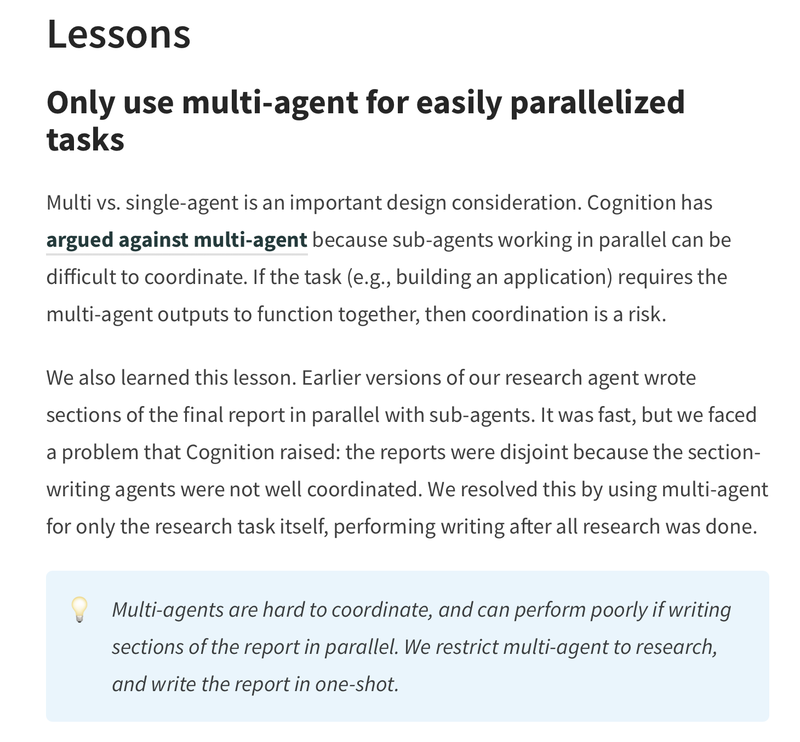

## Open Deep Research from Langchain

[Blog](https://www.blog.langchain.com/open-deep-research/)

[Github](https://github.com/langchain-ai/open_deep_research)

### 有意思的Lesson

可以考虑下如何改进这个点。让sub-agent并发的写各个section，并且能让各个section的内容连贯。

